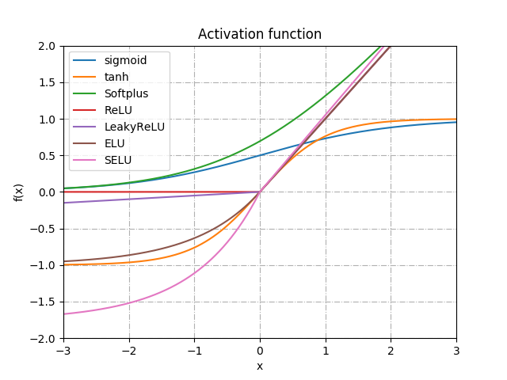
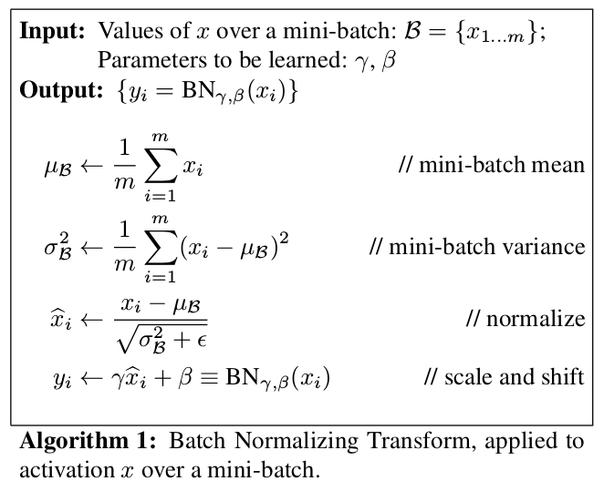

# Classifier

使用PyTorch实现了经典的分类算法：  
* [**LeNet**](#lenet)
* [**AlexNet**](#alexnet)
    * [ReLU](#relu)
* [ZFNet](#zfnet)
* [**VGG**](#vgg)
* [**NIN**](#nin)
* [**GoogLeNet**](#googlenet)
    * [BatchNorm](#batchnorm)
* ResNet
* DenseNet
* SqueezeNet
* MobileNet

------
## Prerequisites:
* anaconda
* pytorch-0.3.0
* torchvision
* visdom

------
## LeNet
[LeNet](http://yann.lecun.com/exdb/publis/pdf/lecun-98.pdf)
是卷积神经网络的开山之作，麻雀虽小但五脏俱全。

### 主要创新点
* 局部感受野(local receptive fields):  
卷积层, 用于提取特征
* 权值共享(shared weights):  
因为目标可能出现在图像的任何位置，所以同一特征图中不同的节点需要在图像的不同位置执行相同的操作。
即，同一层的不同节点拥有相同的权重。该操作使提取的特征拥有了位移不变性，同时大大降低了参数的数量。
* 下采样(sub-sampling):  
pooling层，下采样可以有效的降低输出对尺度和形变的敏感性。
特征图的个数通常随着空间分辨率的降低而增加

#### 卷积

#### max pooling

### 本工程实现的LeNet与原始的LeNet-5略有区别
* 使用了ReLU而不是sigmoid函数
* S2中的每个特征图连接到了每个C3的特征图

### 训练结果
* 在mnist训练集进行了10次迭代，最终在测试集上的识别结果为 0.983
* 在cifar10训练集进行了40次迭代，最终测试集上的识别结果为 0.636
* sigmoid版LeNet在mnist训练集上迭代30次后，识别率达到了0.975

------
## AlexNet
[AlexNet](https://papers.nips.cc/paper/4824-imagenet-classification-with-deep-convolutional-neural-networks.pdf)
在2012年的ImageNet图像分类竞赛中，top-5错误率比上一年的冠军下降了十个百分点，
且远远超过当年的第二名。将沉寂多年的神经网络重新引入了大众的视野。

### 主要创新点
* 非线性激活函数: [**ReLU**](#relu)
* 防止过拟合的方法: Dropout, Data augmentation
* 大数据训练: imageNet
* 高性能计算平台: GPU
* 重叠Pooling: kernel_size=3, stride=2
* 局部响应归一化(LRN, Local Response Normalization), 
[VGG](#vgg)说这个没什么用，可以使用更强大的[BatchNorm](#batchnorm)代替。

### 本工程实现的AlexNet与原始的AlexNet略有区别
* 没有使用LRN
* 没有使用group

### 训练结果
* 在cifar10数据集上没有达到论文中给出的结果, 50次epochs才达到0.706
* cifarNet在5个epochs后达到了0.632，最终在20次epochs后达到了0.784

* 使用预训练好的[AlexNet](https://download.pytorch.org/models/alexnet-owt-4df8aa71.pth)，
在imageNet2012验证集上测试结果为：top1 = 0.565， top5 = 0.791

------
### ReLU
修正线性单元([ReLU](http://proceedings.mlr.press/v15/glorot11a/glorot11a.pdf), Rectified linear unit)
能够有效缓解梯度消失的问题，从而直接以监督的方式训练深度神经网络，无需依赖无监督的逐层预训练。  

#### 优点
* 收敛速度快:  
sigmoid和tanh的梯度在饱和区域非常平缓，接近于0，很容易造成梯度消失的问题，减缓收敛速度。
而ReLu激活函数的梯度为1，而且只有在x的右半轴才饱和，这样使梯度可以很好的反向传播中传递，
不但提高了网络的训练速度也避免了因为梯度消失导致的网络退化。  
另外，如果涉及到概率问题，如DBN, RNN, LSTM中的一些gate，就不能使用ReLU了，需要使用sigmoid, 
不然，概率表达就错了。
* 稀疏激活性:  
大脑同时被激活的神经元只有4%左右，激活稀疏性匹配了生物学的概念。
早期Bengio教授认为稀疏激活性是网络性能提升的原因之一，
但后来的研究发现稀疏性并非是性能提升的必要条件。
如[PReLU](https://arxiv.org/abs/1502.01852), [ELU](https://arxiv.org/abs/1511.07289)等。

#### 缺点
* 神经元死亡: 随着训练的推进，部分输入会落入硬饱和区，导致对应权重无法更新。
(这个问题可以用[Leaky ReLu](http://ai.stanford.edu/~amaas/papers/relu_hybrid_icml2013_final.pdf)解决)
* 输出偏移: 即输出均值恒大于零。(可以使用[BatchNorm](#batchnorm)进行改善)  
偏移现象和神经元死亡会共同影响网络的收敛性。

------
## ZFNet
[ZFNet](https://arxiv.org/abs/1311.2901v3)
是2013年ILSVRC的冠军。其网络结构是在[AlexNet](#alexnet)上进行了微调：

### 主要创新点
* 卷积网络的可视化技术: 反卷积(Deconvolution), 也被称作转置卷积(Transpose convolution)
* 依据可视化的结果，优化了[AlexNet](#alexnet):
    * 第一层卷积的kernel从11改成7; stride从4改称2
    * 去掉了[AlexNet](#alexnet)中的group

#### 卷积与转置卷积
   
图片来自[这里](https://github.com/vdumoulin/conv_arithmetic)

------
## VGG
[VGG](https://arxiv.org/abs/1409.1556)
在2014年ILSVRC挑战中获得了定位问题的第一和分类问题的第二(第一是[GoogLeNet](#googlenet))。
该模型可以很好的推广到其他数据集上，是最常用的base网络之一。
本工程实现了ABDE 4个网络及其添加了[BatchNorm](#batchnorm)的ABDE网络。

### 主要创新点
* 具有小过滤器的深度网络优于具有较大过滤器的浅层网络
* 使用多种尺度的图像进行训练和测试
* deep, very deep, very very deep

### 模型测试
pytorch中给出的VGG的预训练模型在imageNet2012验证集上的测试结果

|VGG|use_BN|no_BN|
|---|---|---|
|VGG11|0.704(0.898)|0.690(0.886)|
|VGG13|0.716(0.904)|0.699(0.892)|
|VGG16|0.734(0.915)|0.716(0.904)|
|VGG19|0.742(0.918)|0.724(0.909)|

------
## NIN
[NIN](https://arxiv.org/abs/1312.4400)
对cnn的结构进行了改进。其提出的1*1卷积和全局均值池化已经成为了后来网络设计的标准结构。

### 主要创新点
* 使用Mlpconv替代卷积：
    * cnn的高层特征其实是低层特征通过某种运算的组合，作者换了个思路，在局部感受野中进行更加复杂的运算。
    * Mlpconv等价于1*1的卷积层。
    * 1*1卷积核可以起到一个跨通道聚合的作用。进一步可以起到降维（或者升维）的作用，起到减少参数的目的
     ([GoogLeNet](#googlenet))。
    * Mlpconv能够提取感受野中的非线性特征，增强了局部模型的表达能力。这样就可以使用均值池化来进行分类。
    
* 使用全局均值池化替代全链接层：
    * 大大降低了参数的数量：原来的cnn参数主要集中在全链接层，特别是与卷积层相连的第一个全链接层。
    * 强化了最后一层特征图与类别的关系：最后一层输出的特征图的空间平均值可以解释为相应类别的置信度。
    * 降低了overfitting：因为均值池化本身就是一种结构性的规则项，且没有参数需要优化。
    使用全链接层的cnn容易过拟合，且严重依赖dropout进行规则化。

### 本工程实现的NIN与原始的NIN略有区别
* 添加了[BatchNorm](#batchnorm)层， 若不添加则很难收敛。
* 去掉了dropout层

### 训练结果
* 在cifar10数据集上，迭代30次后达到了0.897
* 在cifar100数据集上，迭代30次后达到了0.665

------
## GoogLeNet
GoogLeNet包括V1-V4共四个版本，本工程实现了V3版本。

------
* [Inception V1](https://arxiv.org/abs/1409.4842) 
: Going Deeper with Convolutions [2014.9] [top5: 6.67%]

### 主要创新点
* 提出了Inception， 在利用密集矩阵的高计算性能的基础上，保持了网络结构的稀疏性。
22层网络，参数却只有AlexNet的约1/12。
* 使用不同大小的卷积核提取不同大小感受野的特征，然后对不同尺度的特征进行拼接融合。
* 使用1x1卷积核来进行降维。
* 训练时为了避免梯度消失，增加了辅助的softmax用于向前传导梯度（测试时可以忽略）。

------
* [Inception V2](https://arxiv.org/abs/1502.03167)
: Batch Normalization: Accelerating Deep Network Training by Reducing Internal Covariate Shift
 [2015.2] [top5: 4.8%]
 
 ### 主要创新点
 * 提出了[**BatchNorm**](#batchnorm)
    * 提高SGD中的初始学习率： 加快了学习速度，而不会发生梯度弥散
    * 去掉了Dropout层： BN也可以降低过拟合，去掉dropout可以加快学习速度
    * 减小了L2正则化项： L2正则项也是为了降低过拟合，减小L2正则项可以提高准确率
    * 加快了学习率的衰退速度： 因为BN大大加快了学习速度
    * 去掉了LRN层： 都是Normalization
    * 更彻底地打乱训练样本： why？？
    * 减少图像扭曲的使用： epoch数减少，需要多学习真实的数据
 

------
* [Inception V3](https://arxiv.org/abs/1512.00567)
: Rethinking the Inception Architecture for Computer Vision [2015.12] [top5: 3.5%]

### 主要创新点

### 模型测试
pytorch中给出的VGG的预训练模型在imageNet2012验证集上的测试结果

------
* [Inception V4](https://arxiv.org/abs/1602.07261)
: Inception-v4, Inception-ResNet and the Impact of Residual Connections on Learning
 [2016.2] [top5: 3.08%]

------
### BatchNorm

[返回顶部](#classifier)
